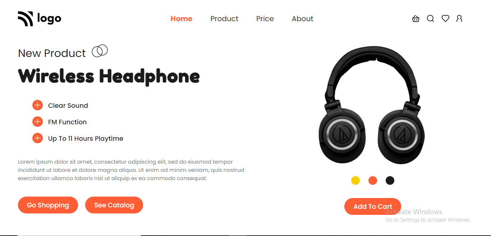

# Portfolio Project 7

## Description

This project is a product display page for a headphone company. It is created using HTML and CSS and is responsive for both mobile and tablet screens.

### Learnings from this project :-

- How to use CSS `Flexbox` properties
- How to use `SVG` images in our HTML file
- How to use CSS `Position` property to position images and svgs
- How to change background color of buttons upon being hovered

### Preview of the project :-

### [**Live link**](https://portfolio-project-7-ecru.vercel.app/) of the project.
